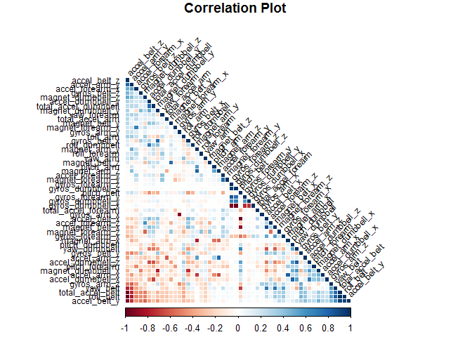

## Predict Human Activity Quality

### 1. Synopsis
In this study, we utilise Random Forest algorithm, with 4 folds cross validation method, to predict the quality of a series of activities conducted by the experiment participants. The model yields an in-sample cross validation error of 0.62%, and the out of sample error for our model is 0.53%. This aligns with our expectation that the out of sample error should be similar to the in-sample cross validation error. Lastly, we use a testing dataset to predict the quality of corresponding activities and submit the results to Coursera for validation.

### 2. Data Processing
This study uses the training dataset, which is extracted from [here](https://d396qusza40orc.cloudfront.net/predmachlearn/pml-training.csv), to specify our acitivity quality prediction model. After downloadning the dataset, we will first load the dataset into the data frame `pml_training`.

```r
pml_training <- read.csv("pml-training.csv", na.strings = c("", "NA"))
```

Columns that contain missing values and unuseful information (such as: user name and time, etc.), will then be removed.

```r
## 1. Identify columns that contain missing values.
temp <- as.data.frame(ifelse(is.na(pml_training), 1, 0))
temp2 <- as.data.frame(matrix(rep(0,dim(temp)[2]), nrow = 1, ncol = dim(temp)[2]))
for (i in 1 : dim(temp)[2]) {temp2[ , i] = sum(temp[ , i])}
names(temp2) <- c(1 : dim(temp)[2])
temp3 <- temp2[ ,colSums(temp2) == 0]

## 2. Remove columns that contain missing values.
pml_training <- pml_training[ , c(as.numeric(names(temp3)))]

## 3. Remove columns that contain unuseful information (such as: user name and time, etc.).
pml_training <- pml_training[ , c(8 : 60)]
```

Lastly, we will split the processed dataset into a training dataset (75% of the observations) and an out of sample dataset (25% of the observations) so that we can perform out of sample validation when developing our model.

```r
library(caret)
set.seed(888)
inTrain <- createDataPartition(pml_training$classe, p = 0.75, list = FALSE)
training <- pml_training[inTrain, ]
out_of_sample <- pml_training[-inTrain, ]
```

### 3. Exploratory Data Analysis
The training dataset contains 53 variables, with the last column containing `classe` variable we are trying to predict. We begin by looking at the correlations between the variables in our dataset. As plot shows that only a few variables shows strong correlation, we will use all variables to predict `classe`.

```r
library(corrplot)
corr <- cor(training[, -53])
corrplot(corr, order = "FPC", method = "color", title = "Correlation Plot", type = "lower",
         tl.cex = 0.75, tl.col="black", tl.srt = 45, mar = c(0, 0, 1, 0))
```

 

### 4. Prediction Model
The prediction model is built by using all varibles in predicting `classe`. Random Forest algorithm is utilised to specify the model, and cross validation method, with 4 folds, is adopted to reduce the variability in the results.

```r
trControl <- trainControl(method = "cv", number = 4)
modFit <- train(training$classe ~ ., method = "rf", trControl = trControl, prox = TRUE, data = training)
```

**As shown below, the final model has an in-sample cross validation error of 0.62%. We expect that the out of sample error should be similar to the cross validation error.**

```r
modFit$finalModel
```

```
## 
## Call:
##  randomForest(x = x, y = y, mtry = param$mtry, proximity = TRUE) 
##                Type of random forest: classification
##                      Number of trees: 500
## No. of variables tried at each split: 27
## 
##         OOB estimate of  error rate: 0.62%
## Confusion matrix:
##      A    B    C    D    E class.error
## A 4179    3    2    0    1    0.001434
## B   19 2823    6    0    0    0.008778
## C    0   10 2549    8    0    0.007012
## D    0    1   24 2383    4    0.012023
## E    0    0    3   10 2693    0.004804
```

Next, we assess the performance of our model using the out of sample dataset that we reserved earlier (25% of the observations).

```r
out_of_sample_results <- confusionMatrix(out_of_sample$classe, predict(modFit, out_of_sample))
out_of_sample_results$table
out_of_sample_results$overall
```

```
##           Reference
## Prediction    A    B    C    D    E
##          A 1395    0    0    0    0
##          B    6  943    0    0    0
##          C    0    5  846    4    0
##          D    0    0    5  799    0
##          E    0    1    4    1  895
```

```
##       Accuracy          Kappa  AccuracyLower  AccuracyUpper   AccuracyNull 
##         0.9947         0.9933         0.9922         0.9965         0.2857 
## AccuracyPValue  McnemarPValue 
##         0.0000            NaN
```

**The out of sample error for our model is 0.53%, this aligns with our expectation that the out of sample error should be similar to the cross validation error.**

```r
out_of_sample_error <- 1 - as.numeric(out_of_sample_results$overall[1])
out_of_sample_error
```

```
## [1] 0.005302
```

### 5. Prediction Results
Lastly, we use a testing dataset, which is extracted from [here](https://d396qusza40orc.cloudfront.net/predmachlearn/pml-testing.csv), to predict the quality of corresponding activities and submit the results to Coursera for validation. To do this, we will first process the testing dataset in a way that is same as the way we processd the training dataset.

```r
pml_testing <- read.csv("pml-testing.csv", na.strings = c("", "NA"))
pml_testing <- pml_testing[, c(as.numeric(names(temp3)))]
pml_testing <- pml_testing[, c(8 : 60)]
```

Next we will apply the model that we estimated using training dataset to predict `classe` using the testing dataset, and the results are shown as followed.

```r
pml_testing_results <- predict(modFit, pml_testing)
pml_testing_results
```

```
##  [1] B A B A A E D B A A B C B A E E A B B B
## Levels: A B C D E
```
